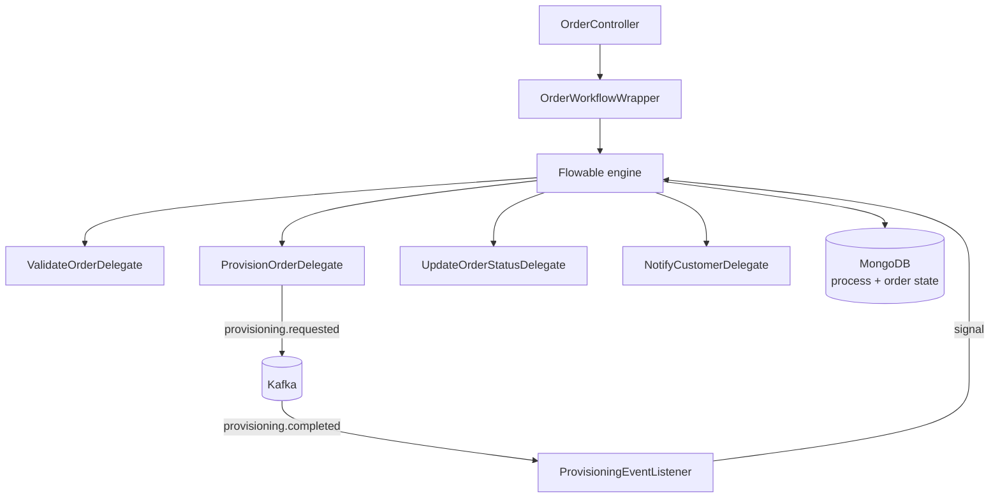

# Order Lifecycle Orchestration

Telecom-style order fulfilment where the process definition is the source of truth,
not something reconstructed by reading six services and asking whoever has been
there longest.

[](https://github.com/mohitshaky/order-lifecycle-bpmn/actions/workflows/ci.yml)
[](https://openjdk.org/)
[](https://spring.io/projects/spring-boot)
[](LICENSE)

---

## Why a process engine rather than more services

Order fulfilment is a sequence: validate, provision, update status, notify. Implement
that as services publishing events to each other and within about two years nobody
can answer three questions that get asked constantly.

*What is the actual sequence?* It exists only as the union of every consumer's
behaviour, which means reading all of them.

*Where is order 4471 stuck?* Somewhere between two topics. Finding out means
correlating log timestamps across services.

*What happens if provisioning fails halfway?* Whatever the retry configuration
happens to do, which nobody chose deliberately.

Modelling the sequence explicitly in BPMN
([`order-fulfillment-process.bpmn20.xml`](src/main/resources/processes/order-fulfillment-process.bpmn20.xml))
makes it a versioned artefact you can open, diff and review. Flowable persists
process state, so "where is this order" becomes a query rather than an
investigation.

The trade is real and worth stating: you take on a process engine, its schema and
its operational behaviour. Below roughly four steps with no compensation logic,
that is not a good deal. This repo is the shape for when it is.

---

## Design



Delegates are deliberately thin. Each one does a single unit of work and returns;
none of them decide what happens next. That decision lives in the process
definition, which is the entire point — business logic in a delegate is business
logic that has escaped the diagram.

Provisioning is asynchronous. `ProvisionOrderDelegate` publishes a request and the
process waits at a receive task;
[`ProvisioningEventListener`](src/main/java/com/mohit/om/service/listener/ProvisioningEventListener.java)
signals the instance when the result comes back. This is what stops a slow
downstream system from occupying a thread for the duration.

`IOrderWorkflowWrapper` keeps Flowable's API behind an interface, so the service
layer talks about orders rather than process instances and the tests do not need
an engine.

---

## Running it

```bash
docker compose up -d        # Kafka, MongoDB
./gradlew bootRun
```

Place an order:

```bash
curl -X POST localhost:8080/api/v1/orders \
  -H "Content-Type: application/json" \
  -d '{"customerId":"CUST-1001","productCode":"BROADBAND-100","tenantId":"acme"}'
```

Then ask where it is:

```bash
curl localhost:8080/api/v1/orders/{orderId}/process
```

That endpoint returns the live process state — current activity, variables and
history. It is the answer to "where is order 4471 stuck", and it exists because
the sequence is modelled rather than implied.

---

## Multi-tenancy

Tenant is carried on the order and used as the Kafka partition key, so one tenant's
volume cannot starve another's ordering guarantees within a partition. Topics are
separated per tenant class in
[`KafkaConsumerConfig`](src/main/java/com/mohit/om/service/config/KafkaConsumerConfig.java).

---

## Tests

```bash
./gradlew test
```

Covers the controller, the service layer and the delegates individually. Delegates
are tested without an engine, which is the payoff for keeping them thin.

---

## Stack

Java 17 · Spring Boot 3 · Flowable BPMN 2.0 · Apache Kafka · MongoDB · Gradle · Docker

---

## Licence

MIT. See [LICENSE](LICENSE).
